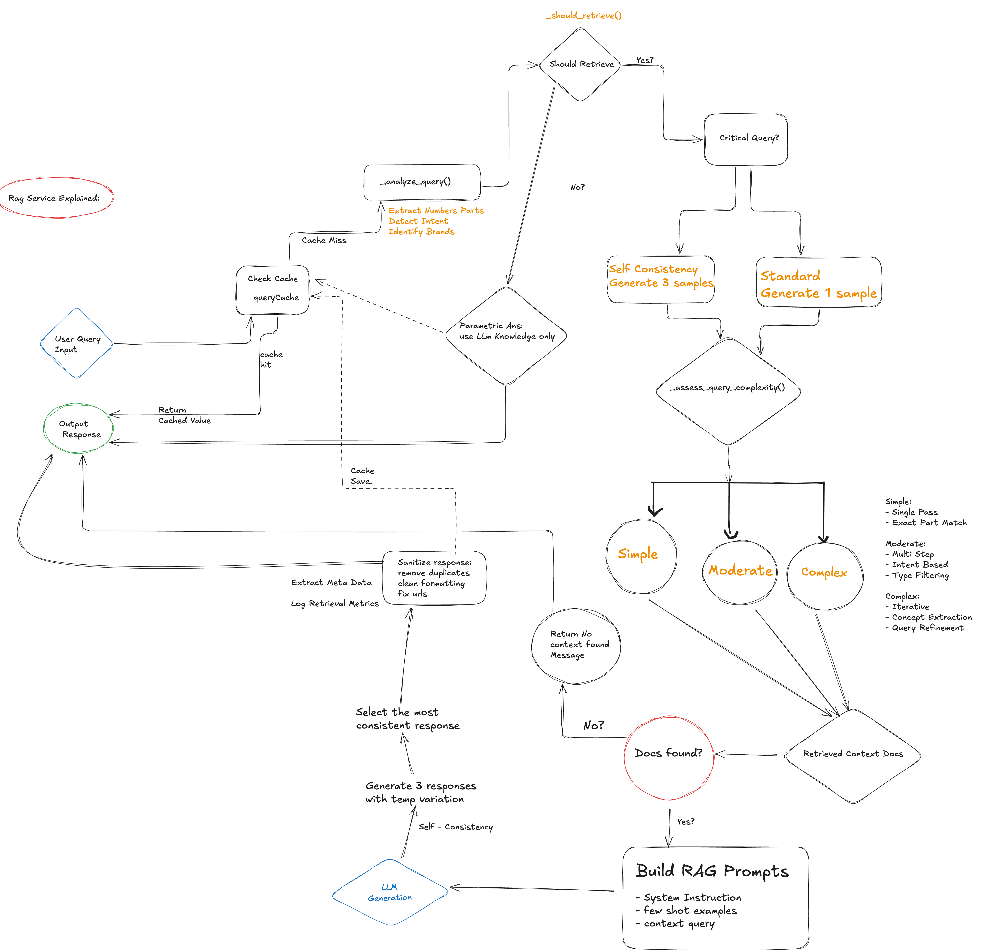

# PartSelect Chat Agent

An AI-powered chat assistant for PartSelect e-commerce, helping customers find refrigerator and dishwasher parts, troubleshoot issues, and get installation guidance using RAG architecture with Deepseek LLM.

## Setup

### Frontend
```bash
cd frontend
npm install
npm start
```

Frontend runs at `http://localhost:3000`

### Backend
```bash
cd backend

# Create a .env file and add the following
OPENROUTER_API_KEY=your_key_here
LLM_PROVIDER=openrouter
LLM_MODEL=google/gemma-3-27b-it:free

# Install dependencies
python3 -m venv venv
source venv/bin/activate  # On macOS/Linux
pip install -r requirements.txt

# Build Vector Store (Production Data)
python3 -m services.ingestion_pipeline

# Start backend server
uvicorn main:app --reload
```

Backend runs at `http://localhost:8000`

## Testing

Run all backend tests:
```bash
cd backend
source venv/bin/activate
pytest tests/ -v --ignore=tests/test_llm_service.py
```

Run specific test suites:
```bash
pytest tests/test_rag_service.py -v
pytest tests/test_prompts.py -v
pytest tests/test_document_loader.py -v
pytest tests/test_chunking_service.py -v
pytest tests/test_embedding_service.py -v
pytest tests/test_ingestion_pipeline.py -v
pytest tests/test_query_cache.py -v
```

## Architecture Diagrams

### System Architecture


### RAG Service Flow
